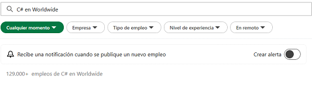

# Tareas-ENDES
Este repositorio es para tareas de ENDES
# Tabla comparativa — Búsqueda de **lenguajes** en LinkedIn
| Lenguaje | Ofertas (Mundo) | Ofertas (España) |
| --- | --- | --- |
| Python | Ofertas en el mundo de python   | Ofertas en España de python  |
| Java | Ofertas en el mundo de Java  | Ofertas en España de Java  |
| JavaScript | Ofertas en el mundo de JavaScript  | Ofertas en España de JavaScript  |
| C++ | Ofertas en el mundo de C++  | Ofertas en España de C++  |
| C# | Ofertas en el mundo de C#  | Ofertas en España de C#  |
| PHP | Ofertas en el mundo de PHP  | Ofertas en España de PHP  |
| Ruby | Ofertas en el mundo de Ruby  | Ofertas en España de Ruby  |
| VB .NET | Ofertas en el mundo de VB .NET  | Ofertas en España de VB .NET  |
| C | Ofertas en el mundo de C  | Ofertas en España de C  |
