# Tareas-ENDES
Este repositorio es para tareas de ENDES
# Tabla comparativa — Búsqueda de **lenguajes** en LinkedIn
| Lenguaje | Ofertas (Mundo) | Ofertas (España) |
| --- | --- | --- |
| Python | 1145000+ 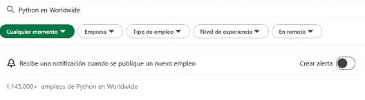 | 16000+ 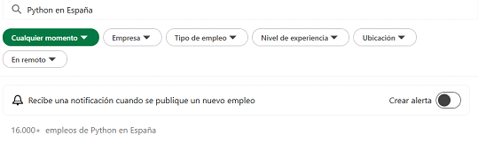|
| Java | 1081000+ 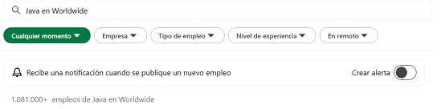| 18000+ 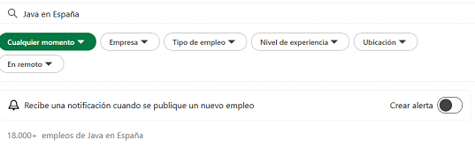|
| JavaScript | 1052000+ 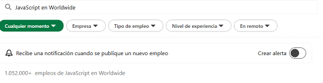| 16000+ 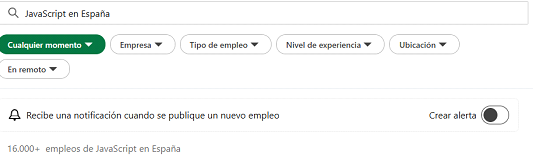|
| C++ | 686000+ 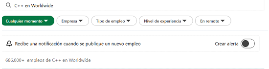| 9000+ 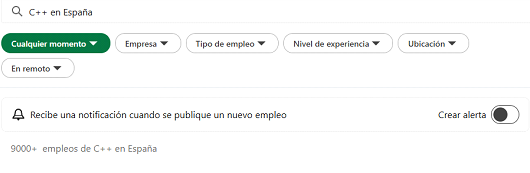|
| C# | 129000+ 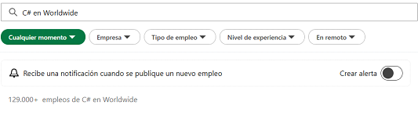| 9000+ 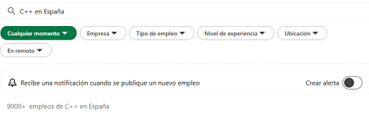|
| PHP | 86000+ 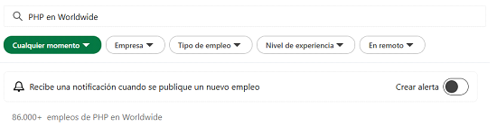| 1000+ 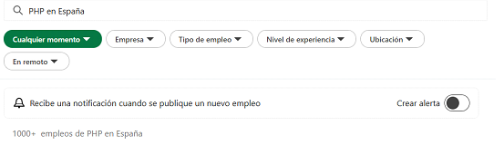|
| Ruby | 15000+ 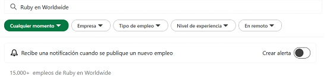| 214 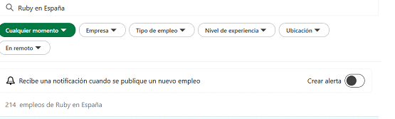|
| VB .NET | 673 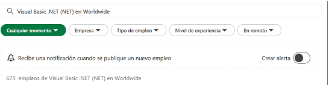| 24 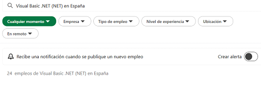|
| C | 104 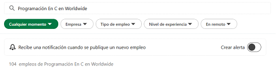| 76 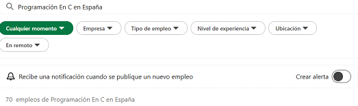|
